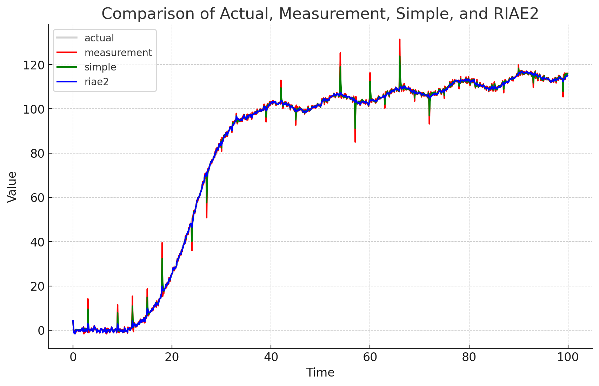
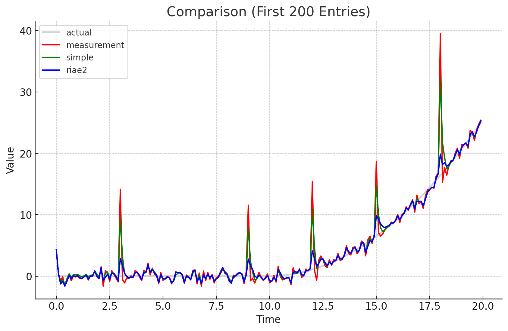

# C++17 Extended Core Library

A comprehensive library targeted for, but not limited to, embedded system (minimum: C++17).
This includes many ported functionality from standard library (`std` -> `xcore`),
hence somewhat independent of standard library.

This library is now merged my old `vt-linalg` linear algebra library, so
you get everything in one place! (Except for dynamic vector/matrix,
only static vector/matrix was ported).

# Safety

Safety is the main principle of this library's design.

* **Memory safety**: Clear size/capacity allocation. Containers that support both stack allocation and
  heap allocation (including dynamic allocation/reallocation). Therefore, you can manage your
  program's memory with less confusion or potential heap fragmentation.
* **User safety**: Many compile-time checks and warnings to enable strong type
  safety and prevent unintentional bugs from the language itself.

# Installation

For installation, please read [How to install](INSTALL.md) for more information.

# Containers

## Array

## Bitset

## Deque/Queue/Stack

## LRU Cache

## String

# Math Module

```c++
#include "xcore/math_module"
```

## Vectors and Matrices

## Kalman Filter

- Simple KF
- Innovation-based Adaptive Estimation Adaptive Kalman Filter (IAE-AKF)
- Robust IAE-AKF
- EKF & UKF (still experimental)





## IMU Utilities

# Utilities

## Nonblocking delay (Smart delay)

## On-off timer

## Tasks and static dispatcher

```c++
#include "xcore/dispatcher"
```
